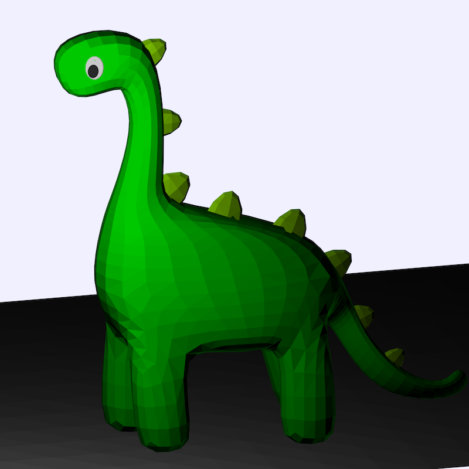
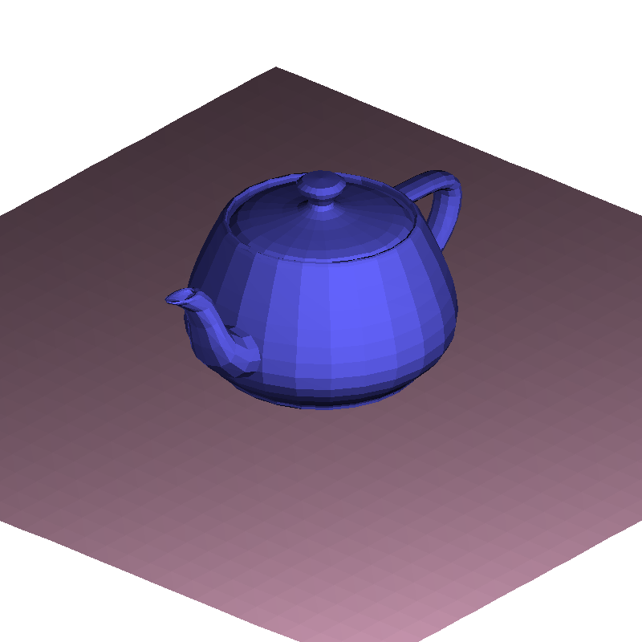

graphics engine
this revision 17/05/2014.
By Darwin Vickers
COMP1917 UNSW

See example.c for typical usage.
Look in .h files for more in-depth documentation.

An overview of project contents follows:

Libraries.

   shared: handy functions + basic types

   Image: ADT representing an image

   vector: vector type + arithmetic

   geometry: types related to 3D space

   Mesh: ADT representing a triangle mesh

   readFile: for reading from MSH and SCN files

   BMPFunctions: Functions for writing an array
   of pixels to a BMP file.

   graphics2D: primitive 2D drawing functions

   camera: camera type + projection maths

   graphics3D: for drawing projections to Image

   object: a physical object; includes a Mesh and a color

   Scene: ADT representing a scene with lights, objects, and camera

Tests. Since tests are in a different folder, they can be
compiled with the option "-iquote ." which will allow them to
#include the necessary headers without being moved.
   
   testCamera.c
   testVector.c
   testGraphics2D.c
    - these require human observation
   testMesh.c
   testReadFile.c
   testImage.c
   testShared.c
   testGeometry.c

Other.
   changelog.txt changes since last revision.
   format.txt information on MSH and SCN formats.
   example.c is an example usage of the library.
   There are a few samle .scn and .msh files in the 'input' folder.
